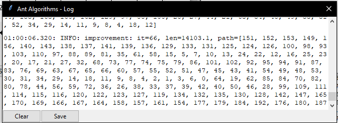

# SFC Project - Ant System Optimization

## Author

Vojtěch Dvořák (xdvora3o)

## About

Application for an interactive demonstration of principles of ant algorithms. Application also contains history of runs that can be used for simple anaylsis of experiments. It includes implementation of ant algorithms (Ant System, Ant Colony, Elitists Strategy, Ant Density, Ant Quantity and Min-Max Ant System) which should be easily reusable as a standalone module and GUI made using *tkinter*.

## Installation

Application was tested on both Windows and Linux in Python 3.12.7. Super new features are not used by this app, so it may work also in older versions of Python, but it is not guaranteed. Application uses *numpy*, *matplotlib*, *tkinter*, *scipy* libraries. All these dependecies can be installed easily on the Linux by the script `install.sh`:

```
sudo bash install.sh
```
Note: Be careful it installs dependencies directly to the system.


Application can be started after this by command:

```
python3 app.py
```

OR you can use trivial script `run.sh`:

```
bash run.sh
```


## Tutorial

Start the app:

```
python3 app.py [<path-to-file-with-data>]
```

### Input and the result of the app

The input data are coordinates of places specified in the JSON format or CSV (TSP). See directory `datasets/` for examples. Although the app is primarily used for demonstration of principles you can get the length of the final path found by algorithm from the log and path itself - it has form of list with indexes of places in the data file. The order of these indexes in the list is the order how you should traverse through these places.


### Choose the file with the data

Data can be specified in the JSON as well as in the CSV format. You can find example datasets in both formats in the directory datasets to see how to prepare your data for ants. You can select the file you want to open by providing it as the first argument of the `app.py` or by selecting it directly in the app:


If the file with the data were parsed and loaded correctly you should see the map displayed in the main window. If not you will see the error message in the log and/or in the terminal.

### Choose the algorithm and change the params

Now (or before the selection of the file with the data) you can select the type of algorithm. Currently you can choose from 6 types of ant algorithms. If you choose the algorithm from combobox on the top of the main window, you can modify its parameters. You can see paremeters in the bottom of the main window.

After modification do not forget to save the changes. All changed parameters will be colored by green color. If they have invalid value they will be colored by the red color. You can also restore the original values (from the last save) by button *Restore Params*.


### Control the execution and check the progress

Once you are satisfied with the settings of parameters, you can finally start the execution of the algorithm. There are two ways how to do it:

**Run** button - By clicking you start the exeuction of algorithm with specified params until it is finished (to the end of the last iteration) or until **Pause**. Exeuction can be also interrupted by saving of parameters (**Save params** button), changing of the type of algorithm or by **Reset** button, but be carefull these types of interruption leads to loss of the progress.

**Step** button - If there is single click only one iteration of algorithm is executed. If If you hold it for a while multiple iterations will be executed until the button is released.

The simplest way how to monitor the exeuction is by the log in the terminal or by the big graph with the data in the main window. Log can be monitored also through the dedicated window (button **Log** in the toolbar in the main window) and it contains records about improving of the solution, info about initialization of algoritm, info about its completion and error messages (if there are any of them).



The best path can be seen in the big graph approximately in the center of the main window - there are dots which denote places described in the file with data and they will be connected by the **best path** (red line). Optionally the pheromone paths can be visualized by using checkbox **Show pheromone**. Under the graph you can see general info about the execution - length of the best path, number of finished iterations, status and average speed. If you want to see more info the graph go to **Settings** in the top toolbar in the main window and use *View* section to display values of pheromone, length of edges in the best path etc.

The last way how you can monitor the execution is through the convergence curve window - it can be opened by button **Convergence** in the toolbar. In this chart you can see the best path len on the Y axis and iterations on the X axis.


IMPORTANT: **When are graph with the best path and convergence cruve updated?** Everytime whe the exectution of algorithm is paused or it has been finished. By default pheromone and best path are not updated continuously to make delays caused by drawing on the canvas smaller. You can activate **Continuous updates** in the **Settings**. Information that you can see under the graph are updated in real time.

### Analyze the results

After you did some experiments you can see them in the history window that can be opened by **History** button (in the toolbar). There is list (tree view) which contains all runs of all algorithms that were executed since the app was started. If you select some of them you can rename it and see description (best path len, parameters etc.). If you select multiple runs you can group them. By clicking on **Display** button (it is visible only if exactly one group or run is selected) you can draw convergence curve. If convergence curve is drawn for a group, aggregated data are used - curve is represents median of the best path len and colored area are values in the 1. and 3. quartile.


You can save or load the current state of history by **Load**/**Save** buttons in the toolbar of history window.

### Save your job

Parameters of the execution can be saved to JSON to be restored in the future by **File** (in the toolbar) -> **Save params** or **File** -> **Save params with seed**. Use the second option if you can restore exactly the same experiment as it was done in time of its execution. The you can load parameters (without or with the seed) by **File** -> **Load params**. Be careful, when you reset the execution (or save/restore params or change the algorithm) the new seed is generated.

### Advanced features

You can use window that can be opened by button **Settings** in the toolbar for configuraing the app in more advanced way. Use can modify seed manually, fix it to avoid regenerating it during the reset of algorithm, visualize more info in the main graph or set number of executions of the algorithm when **Run** is pressed to make more precise evaluations.


## Third party content

TSP demo datasets were downloaded from:

[https://www.math.uwaterloo.ca/tsp/world/countries.html](https://www.math.uwaterloo.ca/tsp/world/countries.html): djibuti38, qatar194, westernsahara29

[https://people.sc.fsu.edu/~jburkardt/datasets/cities/cities.html](https://people.sc.fsu.edu/~jburkardt/datasets/cities/cities.html): usca312
